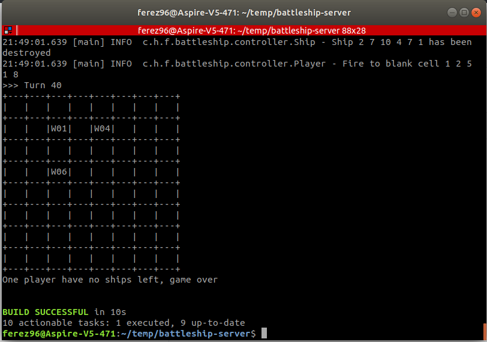

# Hậu duệ Pascal 2019 - Vòng 3

## Hệ thống chấm bài

LVersion: v1.2

> Note: nếu bạn sử dụng Windows, hãy chạy `gradlew.bat` thay vì `gradlew`

### Requirement
Bạn cần các phần mềm sau để có thể chạy chương trình
* Java JDK 8
* gradle 4.9
* mingw hoặc cygwin (dành cho Windows)

### Kiểm tra môi trường

Giả sử bạn đã tải toàn bộ source code về thành công.

#### Đối với Windows
Mở `Windows PowerShell` (hãy từ bỏ `Command Prompt` từ bây giờ)
```bash
java -version
gradle --version
g++ --version
```
Bạn sẽ muốn thấy version của các chương trình trên, nếu không, có thể bạn cài thiếu, hoặc quên chưa [set PATH environment variables](https://www.computerhope.com/issues/ch000549.htm)

#### Đối với Ubuntu
Nhấn `Ctrl+Alt+T` để mở giao diện Terminal
nhập lệnh sau:
```bash
sudo apt install openjdk-8-jdk gradle
```

### Chạy thử chương trình lần đầu tiên

```bash
cd /path/to/battleship-server
gradle wrapper
./gradlew build
./gradlew clear
./gradlew prepare
./gradlew play
```

Nếu chạy đúng, các bạn sẽ nhận được kết quả tương tự thế này: 

### Chuẩn bị cho trận đấu

Chạy lệnh `./gradlew clear` để xóa thư mục `BATTLE_FIELD/` từ trận đấu trước hoặc bạn có thể tự xóa bằng tay.

Chạy lệnh `./gradlew prepare` để tạo thư mục `BATTLE_FIELD/` mới.
Chương trình cũng tự động sinh ra fil: `ships.txt` chứa thông tin 5 thuyền chiến được tạo ngẫu nhiên theo đúng format. nếu bạn muốn sửa nội dung của file này theo ý mình, hãy chú ý giữ đúng format.

### Chạy trận đấu
Chúng tôi cung cấp 2 AI mẫu tại thư mục [player/AI1](player/AI1) và [player/AI2](player/AI2)
Bạn có thể thay đổi source code của AI mẫu, hoặc tự tạo thư mục mới cho AI của mình.
Chỉnh sửa player sẽ đấu với nhau tại file [players.txt](players.txt)
Chạy `./gradlew play` và tận hưởng kết quả

> Note: Nếu bạn muốn in nội dung này ra file `result.txt` thay vì màn hình, hãy chạy: `./gradlew play >result.txt 2>&1 && tail -n22 result.txt`. Nếu chương trình in ra turn cuối và BUILD SUCCESSFUL là ổn.

Have Fun!
